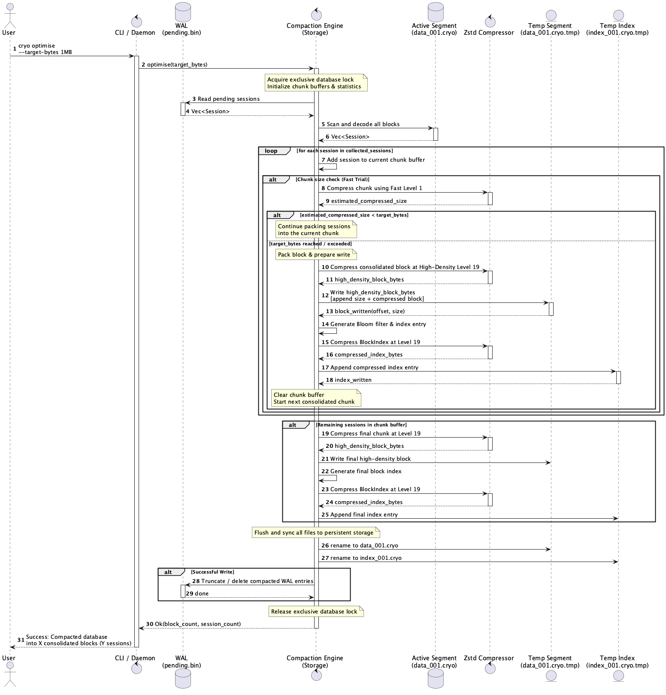
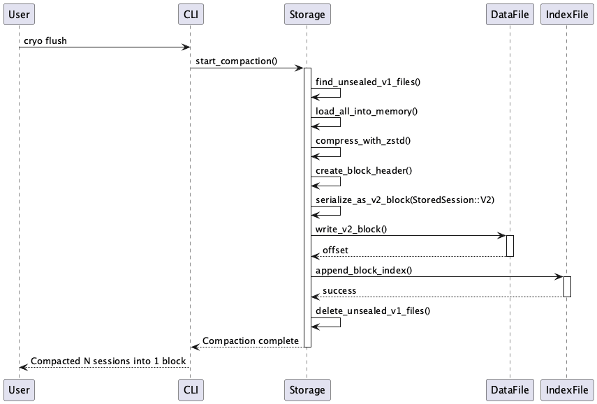
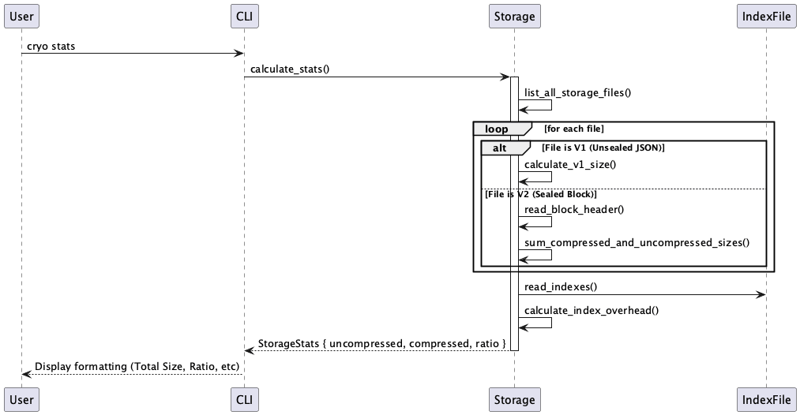

<div align="center">

# Cryo Vault - Conversations Database

A high-performance, highly compressed database for storing chat conversations irrespective of AI or normal chat.

<p>
  <a href="https://github.com/aghontpi/cryo-vault/releases"></a>
  <a href="https://github.com/aghontpi/cryo-vault/blob/main/LICENSE"></a>
</p>

</div>

## Features
- **Built from scratch, designed specifically & optimised for conversations**: Minimal dependencies, single-file architecture.
- **Cross-platform**: Compiles to native binaries (Mac, Linux, Windows and other platforms).
- **High Compression**: Uses a compact binary format (`bincode`) and `zstd` (preset 19) for maximum storage efficiency.
- **Fast Search**: Uses Bloom filters for efficient indexing and querying.
- **Minimal & Efficient**: Ultra-low RAM (**CLI** runs on < 2MB, **MCP Server** takes < 1MB idle); designed for minimal, efficiency, speed, and performance.
- **Portable**: Self-contained; just drop the binary in a folder and go.
- **Dual-Mode**: Works as a standalone **CLI tool**, an **MCP Server** for AI and an **Skill** folder for AI skills.

## Current Limitations
- **Text Only**: Currently optimized for text-based conversations (images/files are not stored).
- **Single Writer**: While concurrent implementation exists, heavy concurrent writes are serialised via locking.

---

## Getting Started

### 1. Install (recommended)

A one-shot installer is provided for each major platform. It detects your OS / arch, drops the binaries under `~/.cryo-vault/versions/<version>/`, symlinks (or shims, on Windows) `cryo` and `cryo-vault-mcp` into `~/.cryo-vault/bin`, and wires that directory onto your `PATH` so typing `cryo` from any new terminal Just Works.

**macOS / Linux:**
```bash
curl -fsSL https://raw.githubusercontent.com/aghontpi/cryo-vault/main/install.sh | bash
```

**Windows (PowerShell):**
```powershell
iwr -useb https://raw.githubusercontent.com/aghontpi/cryo-vault/main/install.ps1 | iex
```

Or, after cloning the repo:
```bash
./install.sh           # macOS / Linux
./install.ps1          # Windows
```

The installer is idempotent: re-running it upgrades to the latest version and removes any prior install it finds. Useful flags:

| Flag (bash / pwsh) | Purpose |
| :--- | :--- |
| `--version v0.2.0` / `-Version v0.2.0` | Pin a specific release. |
| `--prefix <path>` / `-Prefix <path>` | Change the install location (default `~/.cryo-vault`). |
| `--source local\|github` / `-Source local\|github` | Force the binary source. Auto-detects `dist/` when run from a clone. |
| `--force` / `-Force` | Reinstall even if the same version is already present. |
| `--uninstall` / `-Uninstall` | Remove the install and clean the PATH entry. |
| `--no-path` / `-NoPath` | Skip editing your shell rc / user PATH. |

After install, `cryo --help` works from any new shell. The MCP server is available as `cryo-vault-mcp` on the same `PATH` — see [C. MCP Server Usage](#c-mcp-server-usage-for-ai) below.

### 2. Building from source
If you'd rather build it yourself, Cryo Vault produces two binaries:

```bash
cargo build --release
```

- **CLI Binary**: `target/release/cryo-vault` (Main tool for interacting with the database)
- **MCP Binary**: `target/release/cryo-vault-mcp` (Server for AI)

> [!TIP]
> For convenience, alias the CLI binary:
> `alias cryo="./target/release/cryo-vault"`

---

## Usage Guide

Cryo Vault has 3 distinct modes of operation:

### A. CLI Usage
Use the `cryo-vault` binary to manage your database manually.

**Common Commands:**
```bash
# Ingest logs from a file
./target/release/cryo-vault add my_logs.json

# Manual Ingestion (via Stdin)
# You can pipe a JSON string directly to the 'add' command.
# This is useful for scripts or quick manual logging.
```

#### Core Commands Overview (Upgraded in v0.2.0)
Cryo Vault v0.2.0 includes major architecture upgrades to support high-density block storage, unified query pipelines, and backward compatibility.

| Command | Usage | Description | v0.2.0 Upgrades |
| :--- | :--- | :--- | :--- |
| **`add`** | `cryo add [file]` | Ingests a new single session or bulk array. | Can run via stdin (`-`) or with `--stream` flag for event-driven logs. |
| **`flush`** | `cryo flush` | Manually flushes completed sessions from the WAL buffer to the active data segment. | **Upgraded**: Now packs pending sessions into optimized, highly compressed blocks (`StoredSession::Block`) rather than loose individual sessions to reduce fragmentation. |
| **`search`** | `cryo search <query>` | Searches conversation history using indexes and Bloom filters. Supports `--after` and `--before` date/timestamp constraints. | **Upgraded**: Automatically and transparently detects and searches across all block storage versions (V1 single-session, new WAL Block, and legacy V2 compacted blocks) with zero user intervention. |
| **`show`** | `cryo show <session_id>` | Displays full conversation details and metadata for a specific session ID. | **Upgraded**: Auto-detects and extracts the session from any block format on disk (V1, Block, or legacy V2) with zero overhead. |
| **`stats`** | `cryo stats` | Computes comprehensive database diagnostics and statistics across all segments. | **Upgraded**: Aggregates diagnostics seamlessly across all block versions (V1, Block, legacy V2), showing accurate session counts, message counts, time ranges, and size. |
| **`optimise`** | `cryo optimise` | Compacts all segments into dense blocks (default target: ~256KB) for fast search and lower memory. | Uses high-speed Zstd level 1 trial-compression for $O(1)$ pack calculation, and writes to `StoredSession::Block`. |

## JSON Structure & Parameters Information

### Session Object (Root)
| Field | Type | Required? | Description |
| :--- | :--- | :--- | :--- |
| **`messages`** | `Array` | **Yes*** | List of message objects. (*Defaults to empty if missing) |
| `id` | `String` | No | Unique ID (UUID). Auto-generated if omitted. |
| `title` | `String` | No (strongly recommended) | A 3–7 word summary of the session. See [Title expectations](#title-expectations) — omitting this leaves the entry showing up as `Untitled` in `cryo last` / `cryo search`. |
| `source` | `String` | No | Origin (e.g., "cli", "vscode"). |
| `model` | `String` | No | AI model name (e.g., "gpt-4"). |
| `created_at` | `Number` | No | Unix timestamp (seconds). |
| *`...`* | *Any* | No | Extra fields are stored as **metadata**. |

### Message Object (Inside `messages`)
| Field | Type | Required? | Description |
| :--- | :--- | :--- | :--- |
| **`role`** | `String` | **Yes** | "user", "model", "system", "thought", "tool". |
| **`content`** | `String` | **Yes** | The text content. |
| `id` | `String` | No | Unique ID for the message. |
| `parent_id` | `String` | No | ID of the parent message. |

### Title expectations

The `title` field is technically optional for backwards compatibility, but **callers should treat it as required**. It's what `cryo last`, `cryo first`, and `cryo search` print as the human-readable label for each session — when it's missing, the archive becomes a wall of `Untitled` entries that's almost impossible to browse.

When ingesting via the MCP server (i.e. from an AI client), the model is expected to summarise the session into the title field at ingest time. Good titles are:

- **3–7 words**, lowercase or sentence-case, no trailing punctuation.
- A **summary of what the session is about**, not a re-statement of the first user message verbatim.
- Specific enough to find with `cryo search` later.

Examples of good titles: `JWT auth refresh flow`, `Debug Nginx streaming proxy`, `Migrate Postgres to RDS`, `Reproducible build metadata removal`.

Do **not** send the literal strings `Untitled`, `Chat`, `Conversation`, `New chat`, or an empty string — write an actual summary instead. If you genuinely can't summarise the content (e.g. the session contains a single one-word message), fall back to a short topical phrase (`Quick lookup`, `One-off question`) rather than a placeholder.

```bash
## Full Example

echo '{
  "title": "Full Feature Demo",
  "source": "manual-cli",
  "model": "gpt-4o",
  "created_at": 1706123456,
  "custom_tag": "release-candidate",  
  "messages": [
    {
      "role": "system",
      "content": "You are a coding assistant."
    },
    {
      "role": "user",
      "content": "Explain Rust enums.",
      "id": "msg-1"
    },
    {
      "role": "model",
      "content": "Enums in Rust are types that...",
      "parent_id": "msg-1",
      "rating": 5
    }
  ]
}' | ./target/release/cryo-vault add 
```

```bash
## Full Flow Example (CLI)

# 1. Ingest a log (using stdin)
$ echo '{"title": "Terminal Demo", "messages": [{"role": "user", "content": "I am adding this log using a string piped to stdin"}]}' | ./target/release/cryo-vault add 

# 2. Search for the log
$ ./target/release/cryo-vault search "piped to stdin"

# [7c4c8f31-66a4-4de9-8df8-63b05878a564] Terminal Demo

# 3. Display the full conversation
$ ./target/release/cryo-vault show 7c4c8f31-66a4-4de9-8df8-63b05878a564

# Session: 7c4c8f31-66a4-4de9-8df8-63b05878a564
# Title: Terminal Demo
# 
# Messages (1):
# 
# --- Message 1 (User) ---
# I am adding this log using a string piped to stdin

```

## Search (another example)

```bash
$ ./target/release/cryo-vault search "aws"

# ...
# [671ab448-e878-800b-a848-c43ef61504d8] Nginx Configuration for Streaming
# [670e8b9b-0ad8-800b-a97c-662cbb7bd2ec] Zuul Filter zu Spring Boot
# [66deb26e-2fa0-800b-88bf-5e16cdf44c13] Configuring Apigee DNS AWS
# ...

# Show a specific conversation
$ ./target/release/cryo-vault show 671ab448-e878-800b-a848-c43ef61504d8 

# Session: 671ab448-e878-800b-a848-c43ef61504d8
# Title: Nginx Configuration for Streaming
# Source: chatgpt-export
# Created: 1729803337 (2024-10-24 20:55:37 UTC)
# 
# Messages (6):
# 
# --- Message 1 (User) ---
# I hosted a java spring reactive jar inside aws and used reverse proxy, the app has "stream" api...
# 
# --- Message 2 (Tool) ---
# **Identifying the issue**
# 
# The streaming API isn't functioning properly via Nginx, despite POST and GET requests working fine. The nginx configuration, specifically for /task-be/, might need adjustments..(removed for brevity)

```

### v0.2.0 Core Command Upgrades & Backwards Compatibility

Cryo Vault v0.2.0 introduces a unified storage architecture that brings deep performance enhancements while maintaining complete backwards compatibility with older formats.

#### 1. Transparent Multi-Format Support (`search`, `show`, `stats`)
Retrieval, inspection, and database diagnostics now dynamically adapt to your storage history. When you run `search`, `show`, or `stats`, Cryo Vault automatically scans the indexing files and transparently decodes all stored formats on the fly with **zero manual configuration, translation layers, or schema migrations**:
* **`V1` (Single-Session)**: Standard un-compacted session formats.
* **`Block` (New WAL Streaming Block)**: Dense multi-session blocks generated during WAL flushes.
* **Legacy `V2` (Legacy Optimize compacted block)**: Legacy multi-session structures imported from legacy optimization branches.

Whether your data is split across old single sessions, modern streams, or legacy compacted segments, the search engine utilizes bloom filter pruning and time-range boundaries to search all of them simultaneously in sub-milliseconds.

#### 2. Highly Compressed Manual WAL Flush (`flush`)
In previous versions, writing/streaming logs via the WAL would write individual loose sessions upon being flushed. Under v0.2.0, the `flush` command has been upgraded to maintain a high-density storage layout by default:
* Calling `cryo flush` aggregates completed sessions from the Write-Ahead Log (`pending.bin`).
* It packs these sessions together and writes them as an optimized, highly compressed block (`StoredSession::Block`) directly to the active database segment (`.cryo`).
* This eliminates raw, fragmented single-session structures, drastically reduces disk I/O, minimizes index lookups, and significantly speeds up subsequent query runs.

---

### Database Compaction & Optimisation (`optimise`)

Over time, appending loose sessions or streaming logs via the WAL can result in numerous individual session entries on disk. To minimize file handle overhead, optimize indexing, and accelerate search queries, Cryo Vault provides an `optimise` command to compact loose sessions into high-density compressed blocks.

#### How Compaction Works
- **Consolidated Archival**: It reads all sessions from the active database segment and flushes the Write-Ahead Log (WAL) buffer to ensure all recent activity is included.
- **Two-Phase High-Speed Compression**:
  - The packer loop performs a rapid size check by serializing and trial-compressing the growing chunk using **Zstd Level 1** (which is 100x to 500x faster than level 19, running in fractions of a millisecond).
  - Once the target size limit is triggered, the packer seals the block and compresses it at **Zstd Level 19 exactly once** prior to writing it to disk.
  - This reduces the number of Level 19 compressions from $O(N^2)$ to exactly $O(1)$ per block, resulting in a **10x to 100x execution speedup** while preserving maximum storage efficiency.
- **Backwards Compatibility**: Compressed blocks are serialized as `StoredSession::Block`, which remains fully queryable and backwards-compatible with standard query pipelines.

#### Usage
```bash
# Compact the database to the default target block size of ~256 KB
./target/release/cryo-vault optimise

# Compact the database targeting a specific compressed chunk size (e.g., 512 KB)
./target/release/cryo-vault optimise --chunk-kb 512

# Run compaction non-interactively (ideal for automated cron jobs or deployment hooks)
./target/release/cryo-vault optimise --yes
```

#### CLI Options
| Option | Type | Default | Description |
| :--- | :--- | :--- | :--- |
| `--chunk-kb` | `usize` | `256` | Target compressed block size in Kilobytes (KB) to group sessions into. |
| `--yes` | `flag` | - | Skip the interactive confirmation prompt. |

### B. Specific Workflows (Skills)
Check the **[`Skills/`](Skills/)** directory! It contains guides and scripts for specific tasks, such as:
- [**Store Conversations**](Skills/store-conversations/SKILL.md): detailed guide on importing logs, searching history, and using the CLI effectively.
- [**Auto-Capture**](Skills/auto-capture/SKILL.md): canonical instruction snippet that tells any AI agent to archive every finished conversation to Cryo Vault — see the next section for how to install it.

### C. Auto-Capture across AI agents

Tell Claude Code, GitHub Copilot, Antigravity (and any other agent that reads the cross-tool `AGENTS.md` convention) to **automatically archive every finished conversation** to Cryo Vault. The agent itself does the write — preferring the `add_log` MCP tool when connected, falling back to `cryo add` otherwise — so no extra background process is needed.

A one-shot installer drops the instruction snippet (between `<!-- cryo-vault:auto-capture start/end -->` markers, so re-runs replace in place) into the right rule-file for each client:

| Client | Rule file the installer writes to |
| :--- | :--- |
| Claude Code (global) | `~/.claude/CLAUDE.md` |
| Antigravity + cross-tool agents (global) | `~/.gemini/AGENTS.md` |
| VSCode Copilot (project) | `./.github/copilot-instructions.md` |

```bash
# macOS / Linux
./install-agent-rules.sh

# Windows (PowerShell)
./install-agent-rules.ps1
```

Useful flags (both scripts):

| Flag (bash / pwsh) | Purpose |
| :--- | :--- |
| `--uninstall` / `-Uninstall` | Strip the snippet from every target. |
| `--dry-run` / `-DryRun` | Print what would change without modifying files. |
| `--skip-claude` / `-SkipClaude` | Leave Claude Code's CLAUDE.md alone. |
| `--skip-agents` / `-SkipAgents` | Leave Antigravity / AGENTS.md alone. |
| `--skip-copilot` / `-SkipCopilot` | Leave Copilot's instructions file alone. |

Pair this with the MCP server (next section) for the best experience: agents see `add_log` in their tool list, follow its built-in schema and title rules, and your archive fills itself.

### D. MCP Server Usage (For AI)
The `cryo-vault-mcp` binary is designed to be run by AI clients like Claude Desktop, Cursor, or Antigravity. It speaks the [Model Context Protocol](https://modelcontextprotocol.io/).


**Configuration (VSCode / Cursor / Antigravity / Claude Desktop):**
Add this to your MCP settings file:

```json
{
  "mcpServers": {
    "cryo-vault": {
      "command": "/absolute/path/to/cryo-vault/target/release/cryo-vault-mcp",
      "args": [],
      "env": {
        "CRYO_DB_PATH": "/Users/username/.cryo"
      }
    }
  }
}
```
---

**Examples for MCP Server:**

1. **Direct JSON Object (Single Session):**
```json
{
  "data": {
    "id": "optional-uuid", 
    "messages": [
      { "role": "user", "content": "Hello" },
      { "role": "model", "content": "Hi there" }
    ]
  }
}
```

2. **Direct JSON Array (Multiple Sessions):**
```json
{
  "data": [
    {
      "messages": [{ "role": "user", "content": "Session 1" }]
    },
    {
      "messages": [{ "role": "user", "content": "Session 2" }]
    }
  ]
}
```

3. **File Path:**
```json
{
  "data": "/absolute/path/to/chat_log.json",
  "is_file_path": true
}
```

4. **Raw JSON String:**
```json
{
  "data": "{\"messages\": [{\"role\": \"user\", \"content\": \"escaped json string\"}]}"
}
```

## Efficiency of this MCP server

Since its running natively, it just takes 800KB of memory when in idle, while other npx MCP servers take up 50MB of memory when idle.


## Example of running with cli stats
Even your entire life conversations can be stored in less small file sizes

below is my entire chatgpt logs for over 2 years.

```
# View database statistics
./target/release/cryo-vault stats

Database Statistics 
===================
Active File:      data_001.cryo
Total Sessions:   1740
Total Messages:   13050
Disk Usage:       5.58 MB
Time Range:       2023-07-08 16:15:28 UTC to 2026-01-25 23:15:08 UTC
```

> [!NOTE]
> Under the hood, `stats` computes sizes and ranges transparently across all segment files and all compression formats (V1, Block, and legacy V2) with zero user intervention.


## Architecture 

### Core
*Standard import for bulk files or single sessions, bypassing the WAL for performance.*


*Specialized parsing flow for OpenAI ChatGPT export files.*


*Event-driven streaming archival using a Write-Ahead Log (WAL) for safety.*


### Search & Retrieval
*Efficient keyword search using Bloom filters and time-range pruning.*


*O(1) lookup of full session details by unique ID.*


### Maintenance
*Rebuilding the indexing metadata from raw session data.*


*Automatic segment rotation logic to manage large-scale data files.*


#### Database Compaction (Optimise)
*Consolidating WAL segments and active sessions into high-density Zstd compressed blocks.*


#### High-Density Flush
*Packing unsealed active V1 JSON files into a single V2 Block for density.*


#### Storage Statistics
*Dynamically calculating storage sizes across mixed schema formats.*


### Contributing
PRs are welcome! Whether it is a bug fix, new feature, or documentation improvement, feel free to open a pull request.
Please ensure that your code follows standard Rust conventions and that all tests pass before submitting.

### License
This project is licensed under the [GPL-3.0 License](LICENSE).