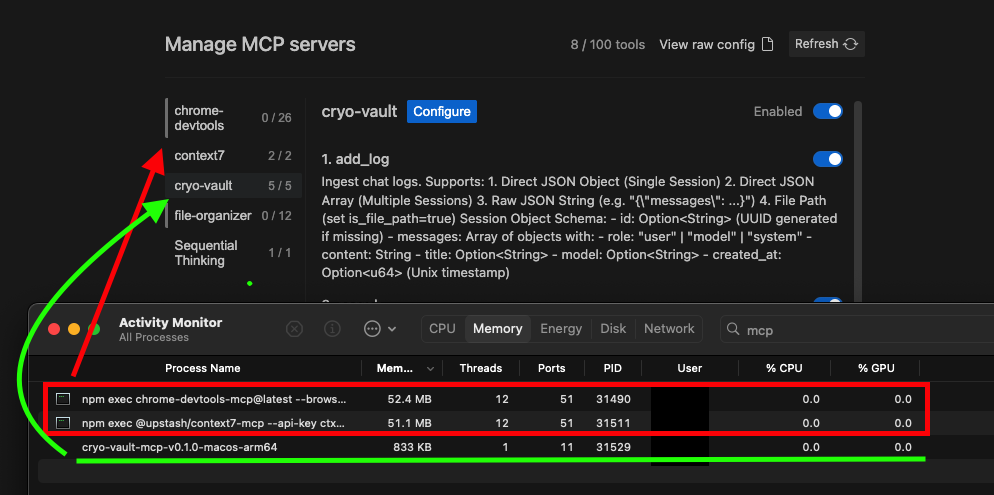
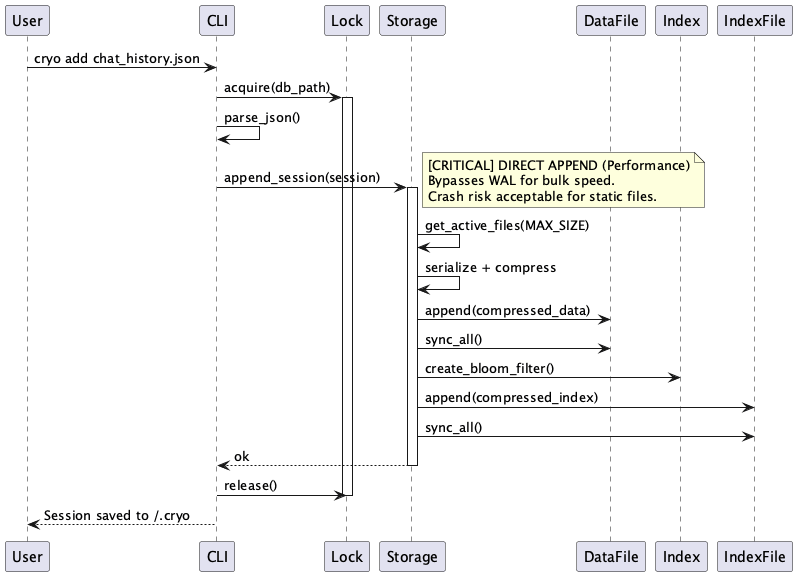
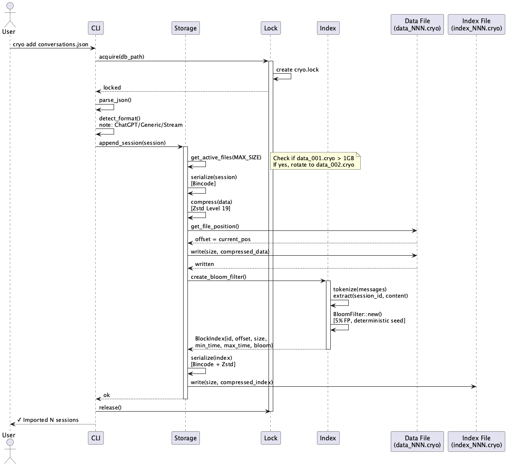
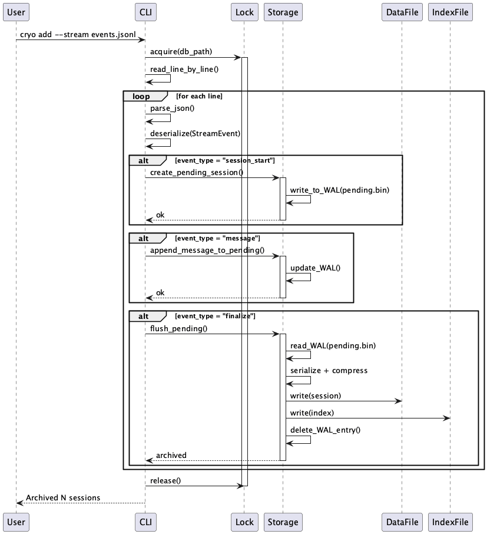
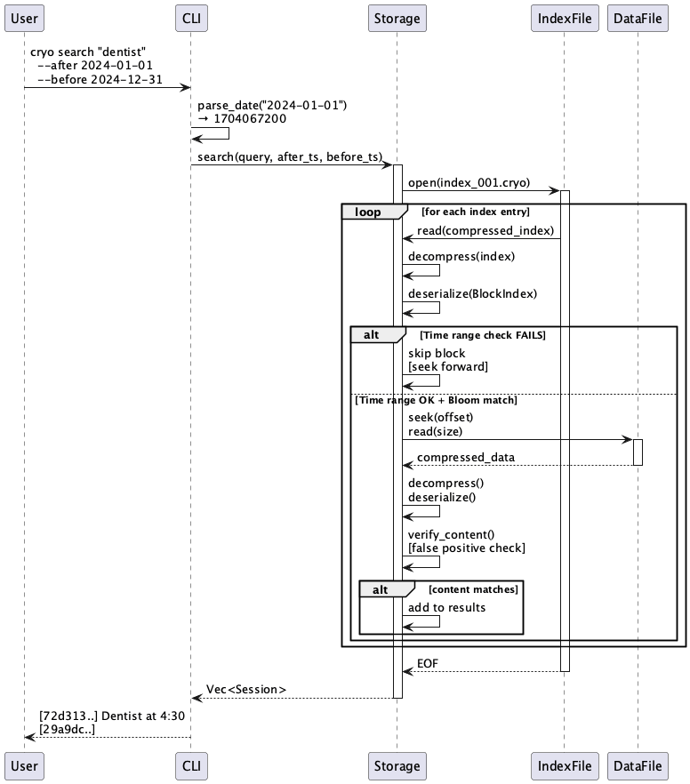
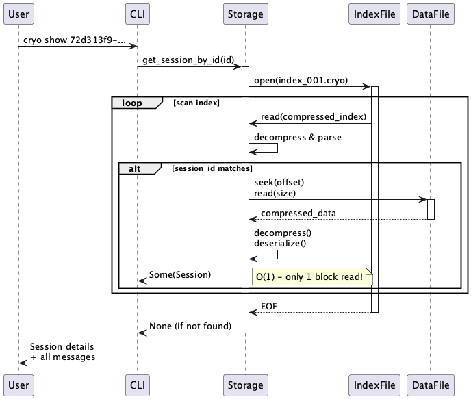
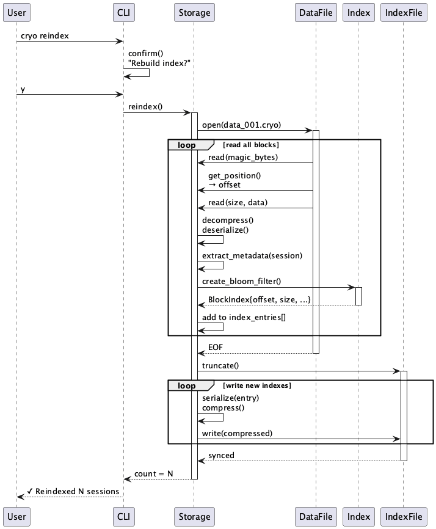
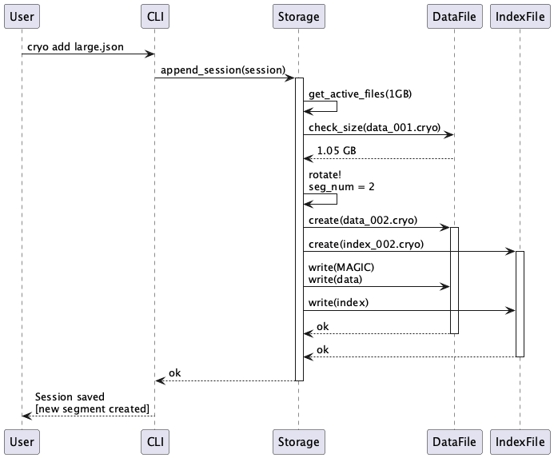

<div align="center">

# Cryo Vault - Conversations Database

A high-performance, highly compressed database for storing chat conversations irrespective of AI or normal chat.

<p>
  <a href="https://github.com/aghontpi/cryo-vault/releases"></a>
  <a href="https://github.com/aghontpi/cryo-vault/blob/main/LICENSE"></a>
</p>

</div>

## Features
- **Built from scratch, designed specifically & optimised for conversations**: Minimal dependencies, single-file architecture.
- **Cross-platform**: Compiles to native binaries (Mac, Linux, Windows and other platforms).
- **High Compression**: Uses a compact binary format (`bincode`) and `zstd` (preset 19) for maximum storage efficiency.
- **Fast Search**: Uses Bloom filters for efficient indexing and querying.
- **Minimal & Efficient**: Ultra-low RAM (**CLI** runs on < 2MB, **MCP Server** takes < 1MB idle); designed for minimal, efficiency, speed, and performance.
- **Portable**: Self-contained; just drop the binary in a folder and go.
- **Dual-Mode**: Works as a standalone **CLI tool**, an **MCP Server** for AI and an **Skill** folder for AI skills.

## Current Limitations
- **Text Only**: Currently optimized for text-based conversations (images/files are not stored).
- **Single Writer**: While concurrent implementation exists, heavy concurrent writes are serialised via locking.

---

## Getting Started

### 1. Building
Cryo Vault produces two binaries: one for CLI usage and one for MCP integration.

```bash
cargo build --release
```

- **CLI Binary**: `target/release/cryo-vault` (Main tool for interacting with the database)
- **MCP Binary**: `target/release/cryo-vault-mcp` (Server for AI)

> [!TIP]
> For convenience, alias the CLI binary:
> `alias cryo="./target/release/cryo-vault"`

---

## Usage Guide

Cryo Vault has 3 distinct modes of operation:

### A. CLI Usage
Use the `cryo-vault` binary to manage your database manually.

**Common Commands:**
```bash
# Ingest logs from a file
./target/release/cryo-vault add my_logs.json

# Manual Ingestion (via Stdin)
# You can pipe a JSON string directly to the 'add' command.
# This is useful for scripts or quick manual logging.
```
## JSON Structure & Parameters Information

### Session Object (Root)
| Field | Type | Required? | Description |
| :--- | :--- | :--- | :--- |
| **`messages`** | `Array` | **Yes*** | List of message objects. (*Defaults to empty if missing) |
| `id` | `String` | No | Unique ID (UUID). Auto-generated if omitted. |
| `title` | `String` | No | A title for the session. |
| `source` | `String` | No | Origin (e.g., "cli", "vscode"). |
| `model` | `String` | No | AI model name (e.g., "gpt-4"). |
| `created_at` | `Number` | No | Unix timestamp (seconds). |
| *`...`* | *Any* | No | Extra fields are stored as **metadata**. |

### Message Object (Inside `messages`)
| Field | Type | Required? | Description |
| :--- | :--- | :--- | :--- |
| **`role`** | `String` | **Yes** | "user", "model", "system", "thought", "tool". |
| **`content`** | `String` | **Yes** | The text content. |
| `id` | `String` | No | Unique ID for the message. |
| `parent_id` | `String` | No | ID of the parent message. |

```bash
## Full Example

echo '{
  "title": "Full Feature Demo",
  "source": "manual-cli",
  "model": "gpt-4o",
  "created_at": 1706123456,
  "custom_tag": "release-candidate",  
  "messages": [
    {
      "role": "system",
      "content": "You are a coding assistant."
    },
    {
      "role": "user",
      "content": "Explain Rust enums.",
      "id": "msg-1"
    },
    {
      "role": "model",
      "content": "Enums in Rust are types that...",
      "parent_id": "msg-1",
      "rating": 5
    }
  ]
}' | ./target/release/cryo-vault add 
```

```bash
## Full Flow Example (CLI)

# 1. Ingest a log (using stdin)
$ echo '{"title": "Terminal Demo", "messages": [{"role": "user", "content": "I am adding this log using a string piped to stdin"}]}' | ./target/release/cryo-vault add 

# 2. Search for the log
$ ./target/release/cryo-vault search "piped to stdin"

# [7c4c8f31-66a4-4de9-8df8-63b05878a564] Terminal Demo

# 3. Display the full conversation
$ ./target/release/cryo-vault show 7c4c8f31-66a4-4de9-8df8-63b05878a564

# Session: 7c4c8f31-66a4-4de9-8df8-63b05878a564
# Title: Terminal Demo
# 
# Messages (1):
# 
# --- Message 1 (User) ---
# I am adding this log using a string piped to stdin

```

## Search (another example)

```bash
$ ./target/release/cryo-vault search "aws"

# ...
# [671ab448-e878-800b-a848-c43ef61504d8] Nginx Configuration for Streaming
# [670e8b9b-0ad8-800b-a97c-662cbb7bd2ec] Zuul Filter zu Spring Boot
# [66deb26e-2fa0-800b-88bf-5e16cdf44c13] Configuring Apigee DNS AWS
# ...

# Show a specific conversation
$ ./target/release/cryo-vault show 671ab448-e878-800b-a848-c43ef61504d8 

# Session: 671ab448-e878-800b-a848-c43ef61504d8
# Title: Nginx Configuration for Streaming
# Source: chatgpt-export
# Created: 1729803337 (2024-10-24 20:55:37 UTC)
# 
# Messages (6):
# 
# --- Message 1 (User) ---
# I hosted a java spring reactive jar inside aws and used reverse proxy, the app has "stream" api...
# 
# --- Message 2 (Tool) ---
# **Identifying the issue**
# 
# The streaming API isn't functioning properly via Nginx, despite POST and GET requests working fine. The nginx configuration, specifically for /task-be/, might need adjustments..(removed for brevity)

```

### B. Specific Workflows (Skills)
Check the **[`Skills/`](Skills/)** directory! It contains guides and scripts for specific tasks, such as:
- [**Store Conversations**](Skills/store-conversations/SKILL.md): detailed guide on importing logs, searching history, and using the CLI effectively.

### C. MCP Server Usage (For AI)
The `cryo-vault-mcp` binary is designed to be run by AI clients like Claude Desktop, Cursor, or Antigravity. It speaks the [Model Context Protocol](https://modelcontextprotocol.io/).


**Configuration (VSCode / Cursor / Antigravity / Claude Desktop):**
Add this to your MCP settings file:

```json
{
  "mcpServers": {
    "cryo-vault": {
      "command": "/absolute/path/to/cryo-vault/target/release/cryo-vault-mcp",
      "args": [],
      "env": {
        "CRYO_DB_PATH": "/Users/username/.cryo"
      }
    }
  }
}
```
---

**Examples for MCP Server:**

1. **Direct JSON Object (Single Session):**
```json
{
  "data": {
    "id": "optional-uuid", 
    "messages": [
      { "role": "user", "content": "Hello" },
      { "role": "model", "content": "Hi there" }
    ]
  }
}
```

2. **Direct JSON Array (Multiple Sessions):**
```json
{
  "data": [
    {
      "messages": [{ "role": "user", "content": "Session 1" }]
    },
    {
      "messages": [{ "role": "user", "content": "Session 2" }]
    }
  ]
}
```

3. **File Path:**
```json
{
  "data": "/absolute/path/to/chat_log.json",
  "is_file_path": true
}
```

4. **Raw JSON String:**
```json
{
  "data": "{\"messages\": [{\"role\": \"user\", \"content\": \"escaped json string\"}]}"
}
```

## Efficiency of this MCP server

Since its running natively, it just takes 800KB of memory when in idle, while other npx MCP servers take up 50MB of memory when idle.




## Example of running with cli stats
Even your entire life conversations can be stored in less small file sizes

below is my entire chatgpt logs for over 2 years.

```
# View database statistics
./target/release/cryo-vault stats

Database Statistics 
===================
Active File:      data_001.cryo
Total Sessions:   1740
Total Messages:   13050
Disk Usage:       5.58 MB
Time Range:       2023-07-08 16:15:28 UTC to 2026-01-25 23:15:08 UTC
```


## Architecture 

### Core
*Standard import for bulk files or single sessions, bypassing the WAL for performance.*


*Specialized parsing flow for OpenAI ChatGPT export files.*


*Event-driven streaming archival using a Write-Ahead Log (WAL) for safety.*


### Search & Retrieval
*Efficient keyword search using Bloom filters and time-range pruning.*


*O(1) lookup of full session details by unique ID.*


### Maintenance
*Rebuilding the indexing metadata from raw session data.*


*Automatic segment rotation logic to manage large-scale data files.*


### Contributing
PRs are welcome! Whether it is a bug fix, new feature, or documentation improvement, feel free to open a pull request.
Please ensure that your code follows standard Rust conventions and that all tests pass before submitting.

### License
This project is licensed under the [GPL-3.0 License](LICENSE).