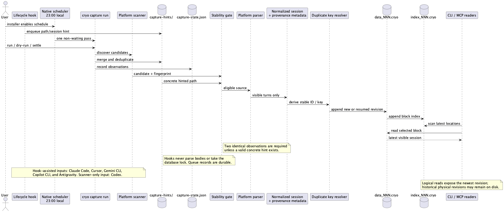
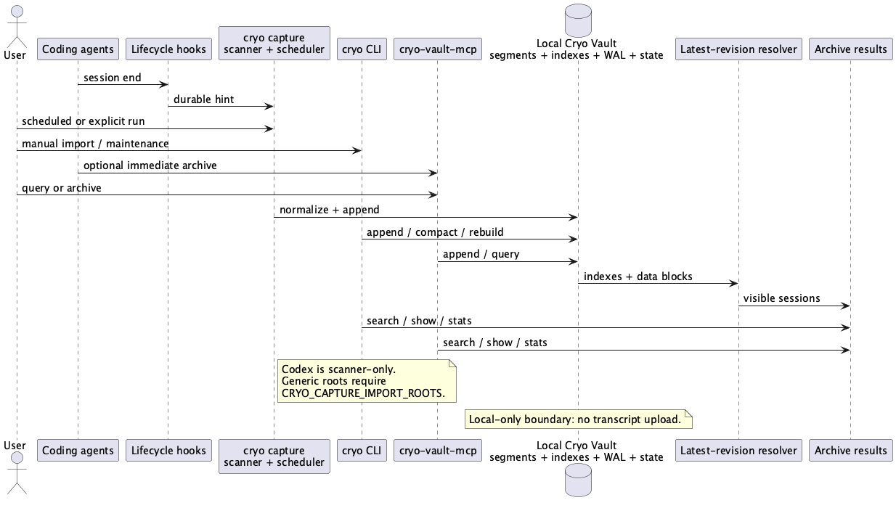

# Cryo Vault architecture

This is the canonical architecture reference for the local conversation
archive. The [README](../README.md) is the user-oriented guide; this document
explains the ownership and persistence boundaries that operators and
maintainers need to understand.

## System overview

Cryo Vault is a local CLI, MCP server, and scheduled transcript collector
sharing one database directory. The collector discovers supported coding-agent
transcripts, extracts visible conversation turns, normalizes them into
`ChatSessionV1`, and appends them to the archive. The CLI and MCP server can
also ingest explicit JSON or ChatGPT exports.

The automatic path is deliberately split into two responsibilities:

1. A client lifecycle hook may enqueue a small, durable hint containing a
   platform, session identifier, and/or concrete transcript path.
2. The native scheduler or an explicit `cryo capture run` discovers, validates,
   parses, deduplicates, and writes the transcript while holding the database
   lock.

Hooks never parse transcript bodies and never write the archive. Codex has no
native hook integration and is scanner-only. Generic import roots are opt-in
through `CRYO_CAPTURE_IMPORT_ROOTS`.





Every diagram PNG embeds its editable PlantUML source in PNG metadata. The
documentation validation gate extracts and re-renders that source; the
available diagrams are listed in the [diagram index](#diagram-index).

## Component ownership

| Component | Owns | Does not own |
| --- | --- | --- |
| Client lifecycle hook | A non-blocking hint record in `capture-hints/` | Transcript parsing, locking, or archive writes |
| Platform discovery | Candidate paths and platform classification | Client configuration beyond the marked hook entries |
| Capture state | File observations, captured fingerprints, schedule metadata, and pending hints in `capture-state.json` | Transcript bodies |
| Platform parser | Conversion of one supported source format into visible `ChatSessionV1` sessions and extraction metrics | Raw source retention |
| Storage | WAL replay, segment append, indexes, compression, rotation, and logical visibility | Remote sync or cloud storage |
| CLI / MCP readers | Search, show, browse, stats, provenance inspection, and explicit imports | Changing client transcripts |

## Supported inputs

The built-in platform scanners use these local roots. The exact client formats
are intentionally kept in the parser implementation because client formats can
change; the table describes the supported boundary rather than promising a
client-owned schema.

| Source | Discovery root | Lifecycle hint |
| --- | --- | --- |
| Codex | `~/.codex/sessions` | Scanner-only |
| Claude Code | `~/.claude/projects` | `SessionEnd` hook |
| GitHub Copilot CLI | `~/.copilot/session-state` | `agentStop` hook |
| Cursor | `~/.cursor/projects` | `sessionEnd` hook |
| Gemini CLI | `~/.gemini/tmp` | `SessionEnd` hook |
| Google Antigravity | `~/.gemini/antigravity-cli` plus read-only legacy roots | Named `Stop` hook |
| Generic | Paths in `CRYO_CAPTURE_IMPORT_ROOTS` | None; always opt-in |

The parsers retain visible user, model, system, and relevant tool context.
Hidden reasoning, internal progress, and client UI noise are excluded. Invalid
JSONL records may be skipped when valid visible turns remain; a source with no
recoverable visible conversation is reported as a safe candidate outcome.

## Capture pipeline

The operational pipeline is:

```text
discovery and hint queue
        ↓
stable-file / concrete-hint eligibility
        ↓
conservative platform parser
        ↓
normalized session + provenance and extraction metadata
        ↓
storage append + index
```

### Discovery and eligibility

`cryo capture run` merges discovered candidates with durable hint records while
holding the database lock. A normal run records the first observation of a
changing file and defers it. A candidate must have two identical observations
of size, modification time, and byte fingerprint before import, unless a valid
lifecycle hint supplies its concrete path. `--settle` explicitly waits and
performs the second pass in the same invocation; the scheduled job remains a
single non-waiting pass.

The queue is made of independent JSON files under `capture-hints/`. Each hook
event creates a new record, so concurrent hooks do not contend on a shared
journal. The collector merges and deduplicates hints, removes only records
represented by saved state, and migrates the old `capture-hooks.jsonl` journal
when possible.

### Parsing and normalization

Each platform parser accepts only its allowlisted transcript shapes. It emits
one or more `ChatSessionV1` values with source metadata such as:

- `source_platform`, source path, and source session identifier;
- the visible-content fingerprint and `capture_revision`;
- `parser_version`, records read, visible messages extracted, malformed
  records, and records skipped by reason; and
- a platform-scoped `duplicate_key` when source identity is unavailable.

Source session identifiers produce stable capture IDs. If a source has no
usable ID, the normalized visible-message fingerprint provides duplicate
protection across moved transcripts or a removed state file. An unchanged
session is reported as `duplicate already archived` rather than appended.

If a transcript is resumed, the same stable ID is appended with an incremented
revision. Physical records remain append-only, but logical reads resolve the
newest revision. Search, show, first, last, stats, and reindex therefore expose
one current session rather than historical duplicates.

## Persistence boundaries

The configured database directory contains independent operational and archive
files:

```text
<db>/
├── data_001.cryo, data_002.cryo, ...   compressed data segments
├── index_001.cryo, index_002.cryo, ... compressed block indexes
├── pending.bin                         framed streaming WAL events
├── capture-state.json                   observations, schedule, pending hints
├── capture-hints/                       one durable JSON record per hook hint
└── capture-duplicate-keys.json         content-dedup ownership map
```

Archive segments begin with `CRYODAT1` and contain framed Zstd-compressed
bincode records. The top-level compatibility wrapper is
`StoredSession::{V1, Block, V2}`:

- `V1` stores one `ChatSessionV1` record;
- `Block` stores multiple sessions, used by bulk append and WAL flush; and
- `V2` is the legacy compacted-block shape retained for reads.

`pending.bin` is a framed JSON-event WAL for streaming input. A flush
reconstructs finalized sessions, skips exact replays, writes one `V1` or
multi-session `Block`, then rewrites the WAL with unfinished events. Direct
bulk imports use `Block` chunks and bypass the WAL. Every archive and index
write uses Zstd level 19, and data segments rotate at 1 GiB.

The data file and index file are parallel append-only streams. Each index entry
stores the session IDs in its block, byte offset, compressed and uncompressed
sizes, message count, time range, and a Bloom filter over IDs and visible text.
The index is an accelerator, not the source of truth: `reindex` can rebuild it
from the data segments.

## Query and read paths

All read paths enumerate every `data_NNN.cryo` / `index_NNN.cryo` segment and
include the pending WAL where appropriate. They decode all three storage
wrappers and collapse repeated IDs to the newest physical revision.

`search` first scans index entries to resolve each session ID to its newest
location. It then applies block-level time and Bloom-filter pruning, reads a
selected data block, decodes it, and performs exact per-session matching. A
Bloom match is only a candidate; the decoded text is verified. `show` likewise
scans index entries to find matching locations and reads the selected block.
Lookup work includes scanning index entries, followed by one selected block
read; it is not constant-time.

`stats` reports logical session and message counts from the newest visible
sessions while also reporting physical compressed and uncompressed bytes, so
superseded revisions can continue to occupy disk until compaction. `reindex`
rebuilds each segment's index atomically and returns the logical visible count.

## Operational lifecycle

The platform installer enables a local 23:00 job unless `--no-capture` or
`-NoCapture` is supplied. `cryo capture install` writes a native scheduler for
the current platform and marked hooks for the supported hook-assisted clients;
`cryo capture status` reports the schedule, hook configuration, state, and
pending hints. The scheduler implementations are launchd on macOS, a systemd
user timer on Linux, and Windows Task Scheduler on Windows.

Use `cryo capture uninstall` to remove Cryo Vault's scheduler and marked hook
entries. It retains the archive, capture state, and unrelated client
configuration. Removing archived data is a separate, user-confirmed operation:
verify the exact configured `--db` / `CRYO_DB_PATH` path before deleting it.

The automatic collector and all CLI/MCP operations are local-only. Transcript
bodies are read from the local profile and written to the configured local
database; diagnostics expose paths, classifications, counters, and extraction
metadata, never transcript message text.

## Related operational references

- [CLI and capture runbook](../README.md#automatic-capture-runbook)
- [MCP usage](../README.md#mcp-server)
- [Store-conversations skill](../Skills/store-conversations/SKILL.md)
- [Auto-capture skill](../Skills/auto-capture/SKILL.md)
- [Capture smoke test](../scripts/capture-smoke-test.sh)
- [Agent-rules installer (Unix)](../install-agent-rules.sh)
- [Agent-rules installer (PowerShell)](../install-agent-rules.ps1)

## Diagram index

Every committed architecture image in `docs/diagrams/` contains its editable
PlantUML source in PNG metadata. The diagrams cover:

- [capture lifecycle](diagrams/capture-lifecycle.png) — automatic discovery,
  hints, eligibility, deduplication, parsing, provenance, storage, and reads;
- [architecture overview](diagrams/architecture-overview.png) — manual CLI,
  MCP, capture, storage, and retrieval relationships;
- [imports](diagrams/import_standard.png),
  [ChatGPT import](diagrams/import_chatgpt.png), and
  [streaming import](diagrams/import_stream.png);
- [search](diagrams/search.png), [show](diagrams/show.png), and
  [stats](diagrams/stats.png); and
- [reindex](diagrams/reindex.png), [rotation](diagrams/rotation.png),
  [optimise](diagrams/optimise.png), and [flush](diagrams/flush.png).

Use the PlantUML generator's `extract` or `update` workflow and run the
documentation validation gate before changing a diagram.
